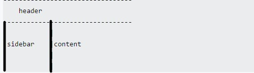
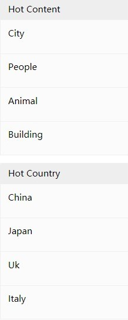
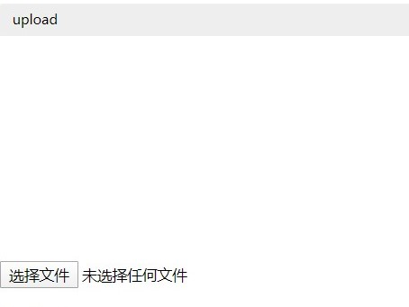

##设计文档
19302010046 &nbsp;&nbsp;陈思帆  
github&nbsp;&nbsp;地址：https://github.com/tengfei12138/tengfei12138.github.io 
github pages&nbsp;&nbsp;地址：https://tengfei12138.github.io/  
  
####1.项目完成情况  
***
1.主页  
* 首页设计思路参考助教的样式，并作出部分调整。  
* 实现助教需求文档关于主页的全部要求。
* 导航栏各超链接的分布有所修改，将search放置在导航栏最右方。
* 导航栏背景颜色为浅色系，Home为绿色，当鼠标移动至超链接处超链接背景颜色改变，字体变为灰色。My Account下各菜单前均有小图标，且鼠标移动
至菜单时背景颜色变为绿色。
* 图片展示区域每个div背景颜色设置为灰色，使其更美观协调。
* 利用js实现回到顶部的操作
 javascript: scroll (0,0) 

2.浏览页
* 参考助教给出的示例的部分样式，基本实现助教需求文档关于浏览页的要求。  
* 采用最上端为导航栏，导航栏下端左侧为侧边栏，右侧为内容展示的布局。利用两个div设置为浮动效果实现。  
   
 * 利用js实现select的二级联动，设置中国，英国，美国及其部分城市。
 * 左侧侧边栏的搜索及热门城市及地区均用div分割，且热门城市及热门内容的首栏均使用灰色背景，使其更美观。
   
     
3.搜索页
* 参考助教给出的示例的部分样式，实现助教需求文档关于搜索页的全部要求。
* 用标题搜索及使用具体描述搜索设置为只能选中其中一个。
* 部分div背景采用灰色背景，使搜索结果及分割栏更清晰。

4.上传页面
* 参考助教给出的示例，但有较大的改动。基本实现助教需求文档关于上传页的全部要求。
 
 * 图片上传页面如上图。利用js实现本地图片上传，且能够指定尺寸预览。
 * 底部提交按钮设置适当宽度，并设置背景颜色为绿色，使其更明显协调。
 
 5.我的照片页面
 * 参考助教给出的示例的样式。实现助教需求文档关于我的照片页面的全部要求。
 * 利用浮动div使文字描述位于图片右侧。合理设置修改及删除的位置，并字体颜色设置为绿色，使其更显眼。
 * 每个展示图片的div背景颜色设为灰色，便于区分。
 
 6.我的收藏页面。
 * 参考助教给出的示例的样式。实现助教需求文档关于我的收藏页面的全部要求。
 * 利用浮动div使文字描述位于图片右侧。合理设置删除的位置，并字体颜色设置为绿色，使其更显眼。
  * 每个展示图片的div背景颜色设为灰色，便于区分。
  
  7.登录页面及注册页面。
  * 参考助教给出的示例的基本样式，实现助教需求文档关于登录及注册页面的全部要求。
  * 登入页面和注册页面共用同一个css。
  * 将登录及注册的主体内容网页居中，且设置为灰色背景，与页面形成对比，使其更明显美观。
  * 登录及注册页面的最上方为网页logo。
  
  8.图片详情页。
  * 参考助教给出的示例的基本样式。实现助教需求文档关于图片详情页的全部要求。
  * 利用div浮动布局，左侧为图片，右侧为图片相关信息。
  * 收藏按钮加宽且设为饱和度适中的红色，使其更美观协调。
  ***
  ####2.Bonus的完成情况及解决方法。
  ***
  1.实现更复杂的图片处理。  
  * 采用两种方法对自由版式的图片进行处理，使其变为固定版式的图片。  
    &nbsp;&nbsp; 主页：使用object-fit ：cover并适当设置图片固定的宽和高。对与固定宽度高度不相
    匹配的图片进行裁剪以适应固定宽度和高度。  
    &nbsp;&nbsp; 其他页面：将图片设置为div的背景图片。利用background-size:cover和设置div的固定
    高度和宽度以达到图片自动裁剪的效果。   
    
2.响应式布局。  
* 由于在设计pj之初未考虑响应式布局，故未能及时修改代码。
* 但已经有思路，思路如下：利用css的媒体查询在不同尺寸下的屏幕对同一个元素设置不同的样式，且与百分比布局相结合。
高度大都由px来固定，使用%百分比定义宽度。   

3.界面的美观。
* 通过div的浮动布局以及对颜色，宽度，margin，padding等调整使页面更协调美观。  

***
###3，对pj1和本门课程的意见和建议。  
***
* 意见
1.感谢老师和助教们的耐心细致的指导和帮助。  
2.根据课程进度适当调整pj的确很重要。 （尤其对基础不是很好的我orz）   
* 建议 1.对于pj的bonus部分，可以给出更详细完善的建议和完成要求。
2.可以对每次的lab给出反馈和修改意见。